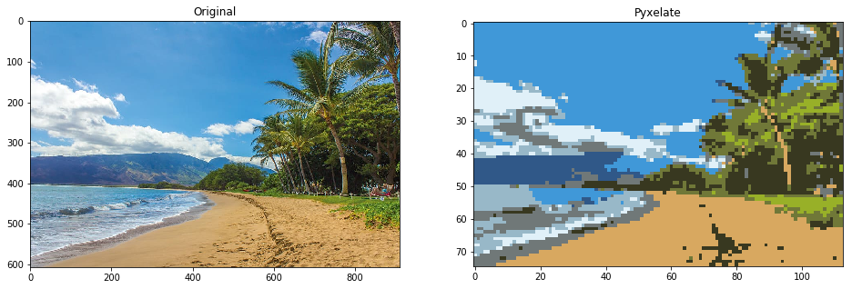
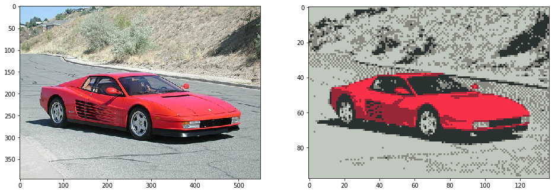
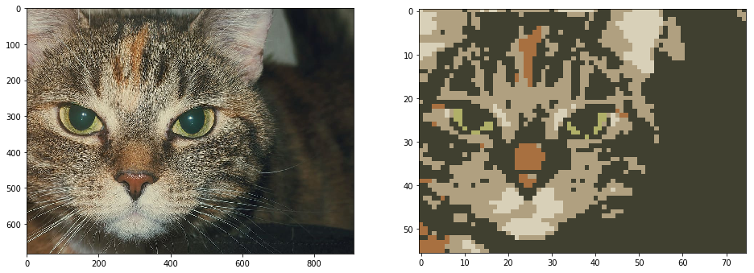
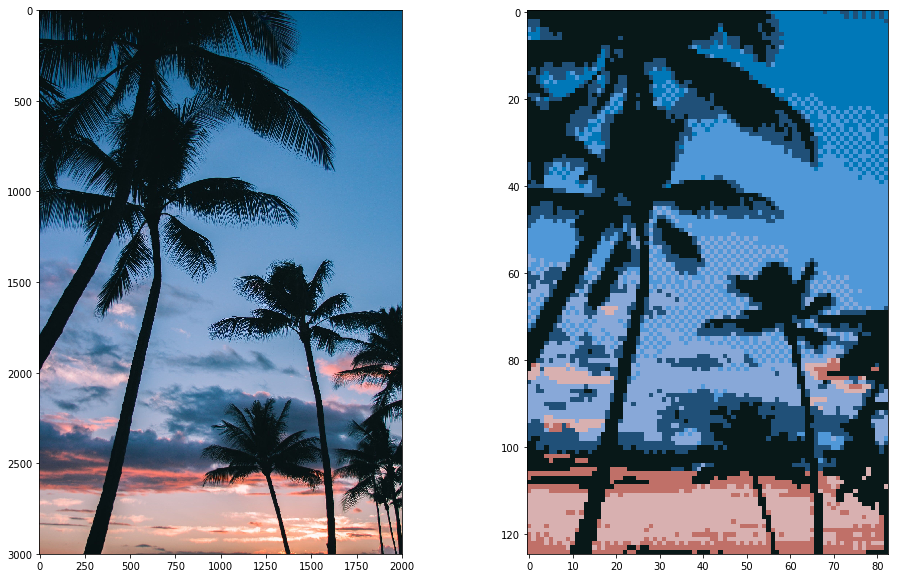
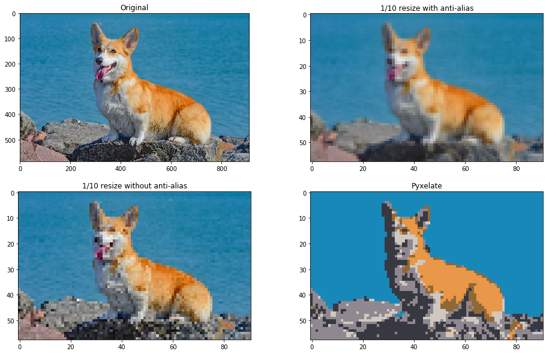

# Generate pixel arts from images
Pyxelate is a Python class that downsamples images into 8-bit pixel arts.



The method **does more than simply resizing an image with a reduced palette**!
The class tires to iteratively approximate a pixel art by only sampling pixels based on the orientation of edges in the input image. 
Then it uses unsupervised machine learning to generate the basis for an 8-bit color palette.  

### Installation

```
pip3 install git+https://github.com/sedthh/pyxelate.git
```



### Example usage:
```python
from pyxelate import Pyxelate
from skimage import io
import matplotlib.pyplot as plt

img = io.imread("cat.jpg")
# generate pixel art that is 1/12 the size
height, width, _ = img.shape 
colors = 5
dither = False
p = Pyxelate(height // 12, width // 12, colors, dither)
img_small = p.convert(img)  # convert an image with these settings

_, axes = plt.subplots(1, 2, figsize=(16, 16))
axes[0].imshow(img)
axes[1].imshow(img_small)
plt.show()
``` 


### API

The **Pyxelate()** class accepts the following init parameters:
- **height**: the height of the result image (height was chosen to be first parameter to mirror the array representation)
- **width**: the width of the result image
- **color**: the number of colors (default is 8)
- **dither**: apply dithering (default is True) 
- **regenerate_palette**: if set to False, then the palette will only be generated once, and all future images will be generated using this original palette. This is useful for generating a sequence of images with the same palette (the default value is True, all images will have their own palettes).
- **random_state**: the random state for the Bayesian Gaussian Mixture model (default is 0)

Once the class is created, call **convert(image)** by passing a NumPy array representation of the image.  

**NOTE:** the process is pretty time consuming, generating large pixel arts can take quite a while!



### Details

The method applies a few computer vision functions for preprocessing. Then simple convolutions are applied on the images. The downsampled areas are calculated based on their gradients' magnitudes and orientation. 
The function was inspired by the [Histogram of Oriented Gradients](https://scikit-image.org/docs/dev/auto_examples/features_detection/plot_hog.html) method.
Once it's done, a [Bayesian Gaussian Mixture](https://scikit-learn.org/stable/modules/generated/sklearn.mixture.BayesianGaussianMixture.html) model is fitted (instead of conventional K-means) to find a reduced palette. 
Using the centroids of the overlapping gaussians as "mean" colors is an empirically better choice,
as cluster centroids for rare colors would have less effect on the rest of the palette due to 
their smaller covariances (allowing flatter gaussians to eventually take over). 
Since it also predicts probabilities, iteratively polling from the first and second best prediction over a threshold allows simple dithering.   
The dirichlet distributions will put less weight on unnecessary clusters as well.  



### CLI

```pyx.py``` is the command line interface for the Pyxelate class and accepts a bunch of arguments to process multiple files one after another.

``` none
usage: pyx.py [-h] [-f scale down input image by factor] [-s scale up output image by factor] [-c colors] [-d dither] 
              [-r regenerate_palette] [-t random_state] [-i folder of input images] [-o folder of output images]
```

If no **--output** was defined, a **pyxelated/** folder will be created for output images. 


### Requirements

The Pyxelate class requires Python 3.7+ and relies on the following libraries to run:
- [skimage 0.16.2](https://scikit-image.org/)
- [sklearn 0.22.1](https://scikit-learn.org/stable/)

The source code is available under the MIT license.
